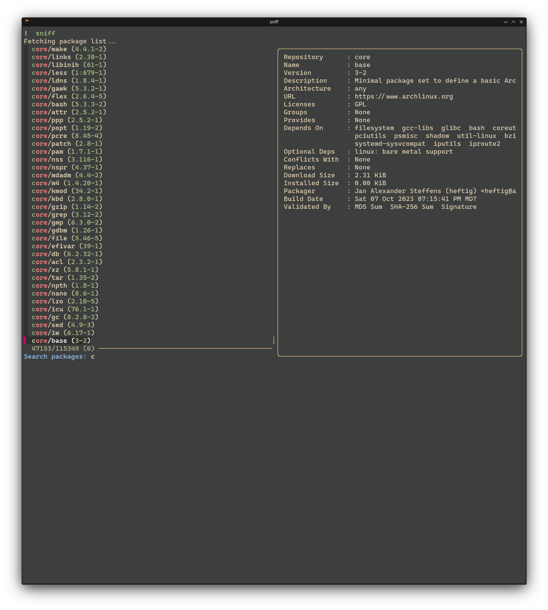

## Sniff 

A script that emulates Omarchys pacman search/install.
Requires Yay and Fzf

## "Install"

- Clone/download packagesearch.sh and alias it to your command of choice
```
wget https://raw.githubusercontent.com/Deen-Weible/Sniff/refs/heads/main/packagesearch.sh
```
- add the alias to your .basrc/.zshrc/etc
```
alias sniff='<path to script>'
```

## Screenshots

  
 
